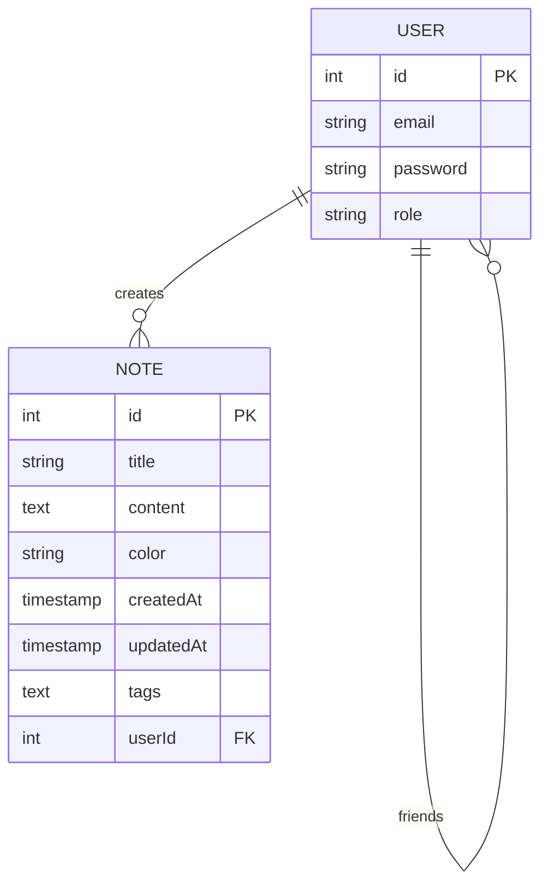

# KeepNote

KeepNote is a full-stack note-taking application built with Next.js, React, TypeScript, and PostgreSQL. It allows users to create, share, and organize notes with friends while providing features like tagging and calendar integration.

## Features

- **User Authentication**

  - Register with email and password
  - Login/Logout functionality
  - Role-based access (Default User and Admin)
  - Password change capability
  - Account management (nickname change, account removal)

- **Note Management**

  - Create notes with random pastel colors
  - Automatic creation and update timestamps
  - Rich text content support
  - Tagging system for easy organization
  - Calendar integration for scheduled notes

- **Social Features**

  - Add other users as friends
  - Share notes with friends
  - Shared notes appear on friends' dashboards

- **Admin Features**
  - All default user capabilities
  - User management (ability to delete default users)

## Technology Stack

- **Frontend**: React.js with Next.js
- **Backend**: Next.js API routes
- **Database**: PostgreSQL
- **Cache**: Redis
- **ORM**: TypeORM
- **API Documentation**: Swagger
- **Containerization**: Docker & Docker Compose

## Database Schema

### User Table

```sql
CREATE TABLE "user" (
    "id" SERIAL PRIMARY KEY,
    "email" VARCHAR UNIQUE NOT NULL,
    "password" VARCHAR NOT NULL,
    "role" VARCHAR NOT NULL DEFAULT 'default'
);
```

### Note Table

```sql
CREATE TABLE "note" (
    "id" SERIAL PRIMARY KEY,
    "title" VARCHAR NOT NULL,
    "content" TEXT NOT NULL,
    "color" VARCHAR NOT NULL,
    "createdAt" TIMESTAMP NOT NULL DEFAULT now(),
    "updatedAt" TIMESTAMP NOT NULL DEFAULT now(),
    "tags" TEXT,
    "userId" INTEGER REFERENCES "user"(id)
);
```

### User Friends Relationship Table

```sql
CREATE TABLE "user_friends_user" (
    "userId_1" INTEGER NOT NULL,
    "userId_2" INTEGER NOT NULL,
    PRIMARY KEY ("userId_1", "userId_2"),
    FOREIGN KEY ("userId_1") REFERENCES "user"(id) ON DELETE CASCADE,
    FOREIGN KEY ("userId_2") REFERENCES "user"(id) ON DELETE CASCADE
);
```

## ERD (Entity Relationship Diagram)



## Getting Started

1. Clone the repository:

```bash
git clone https://github.com/yourusername/keepnote.git
cd keepnote
```

2. Create `.env` file with the following variables:

```env
NODE_ENV=development
APP_PORT=3000
DB_HOST=postgres
DB_PORT=5432
DB_USER=youruser
DB_PASSWORD=yourpassword
DB_NAME=keepnote
REDIS_HOST=redis
REDIS_PORT=6379
PGADMIN_PORT=5050
PGADMIN_EMAIL=admin@admin.com
PGADMIN_PASSWORD=admin
JWT_SECRET=your-secret-key
```

3. Start the application:

```bash
docker-compose up -d
```

4. Access the application:

- Web App: http://localhost:3000
- PGAdmin: http://localhost:5050
- Swagger API Documentation: http://localhost:3000/api-docs

## API Documentation

The API documentation is available through Swagger UI at `/api-docs` endpoint when running the application. It provides detailed information about all available endpoints, request/response formats, and authentication requirements.

## License

This project is licensed under the MIT License - see the [LICENSE](LICENSE) file for details.

## Credits

Developed with ❤️ using:

- [Next.js](https://nextjs.org/)
- [React](https://reactjs.org/)
- [TypeORM](https://typeorm.io/)
- [PostgreSQL](https://www.postgresql.org/)
- [Redis](https://redis.io/)
- [Docker](https://www.docker.com/)
