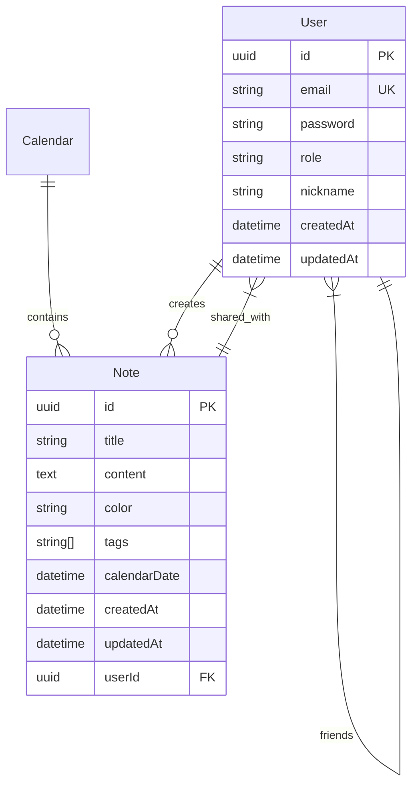

# KeepNote

A modern note-taking web application built with Next.js 15 and React 19 that allows users to create, share, and organize notes with calendar integration.


## Features

### User Management
- Account creation with email/password
- Role-based access (Default User/Admin)
- Profile management
- Friend system for note sharing

### Note Management
- Create notes with random pastel colors
- Rich text content support
- Automatic timestamps
- Tag system for organization
- Calendar integration
- Note sharing with friends

### Admin Features
- User management dashboard
- Account deletion capabilities
- System monitoring


## Technology Stack

### Frontend
- React 19 with Next.js 15
- TailwindCSS with SASS
- Zod + React Hook Form
- TypeScript

### Backend
- Next.js API routes
- TypeORM
- PostgreSQL
- Redis
- Swagger API documentation

### DevOps
- Docker
- Docker Compose

## Getting Started

### Prerequisites
- Docker and Docker Compose
- Node.js 18+ (for local development)

### Setup

1. Clone the repository:
```bash
git clone https://github.com/Jarsey45/KeepNote2.git
cd KeepNote2
```

2. Create `.env` file in root directory:
```env
NODE_ENV=development
APP_PORT=3000
DB_HOST=postgres
DB_PORT=5432
DB_USER=keepnote
DB_PASSWORD=keepnote
DB_NAME=keepnote
REDIS_HOST=redis
REDIS_PORT=6379
PGADMIN_PORT=5050
PGADMIN_EMAIL=admin@admin.com
PGADMIN_PASSWORD=admin
JWT_SECRET=your-secret-key
```

3. Start the application:
```bash
docker-compose up -d
```

4. Apply database migrations:
```bash
docker exec -it keepnote2-app-1 npm run migration:run
```

### Accessing Services
- Web Application: http://localhost:3000
- PgAdmin: http://localhost:5050
- API Documentation: http://localhost:3000/api-docs

## Database Schema

### User Table
```sql
CREATE TABLE "user" (
    id UUID PRIMARY KEY DEFAULT uuid_generate_v4(),
    email VARCHAR UNIQUE NOT NULL,
    password VARCHAR NOT NULL,
    role VARCHAR NOT NULL DEFAULT 'default',
    nickname VARCHAR,
    created_at TIMESTAMP DEFAULT now(),
    updated_at TIMESTAMP DEFAULT now()
);
```

### Note Table
```sql
CREATE TABLE "note" (
    id UUID PRIMARY KEY DEFAULT uuid_generate_v4(),
    title VARCHAR NOT NULL,
    content TEXT NOT NULL,
    color VARCHAR NOT NULL,
    tags TEXT[],
    calendar_date TIMESTAMP,
    user_id UUID REFERENCES "user"(id) ON DELETE CASCADE,
    created_at TIMESTAMP DEFAULT now(),
    updated_at TIMESTAMP DEFAULT now()
);
```

### Note Sharing Table
```sql
CREATE TABLE "user_shared_notes_note" (
    user_id UUID REFERENCES "user"(id) ON DELETE CASCADE,
    note_id UUID REFERENCES "note"(id) ON DELETE CASCADE,
    PRIMARY KEY (user_id, note_id)
);
```

## ERD (Entity Relationship Diagram)


## Screenshots

## Contributing

1. Fork the repository
2. Create your feature branch (`git checkout -b feature/AmazingFeature`)
3. Commit your changes (`git commit -m 'Add some AmazingFeature'`)
4. Push to the branch (`git push origin feature/AmazingFeature`)
5. Open a Pull Request

## License

This project is licensed under the MIT License - see the [LICENSE](LICENSE) file for details.

## Credits

Developed with ❤️ by **Jarsey45** using:

- [Next.js](https://nextjs.org/)
- [React](https://reactjs.org/)
- [TypeORM](https://typeorm.io/)
- [PostgreSQL](https://www.postgresql.org/)
- [Redis](https://redis.io/)
- [Docker](https://www.docker.com/)
- [TailwindCSS](https://tailwindcss.com/)
- [NextUI](https://nextui.org/)
